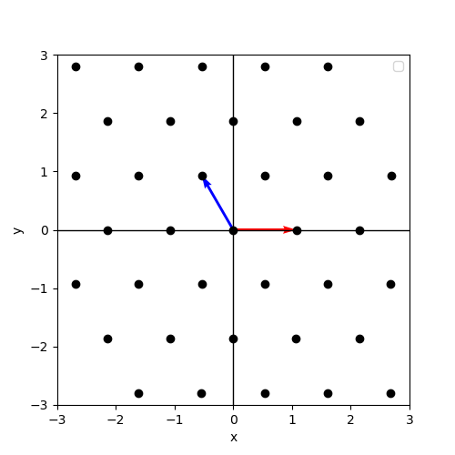
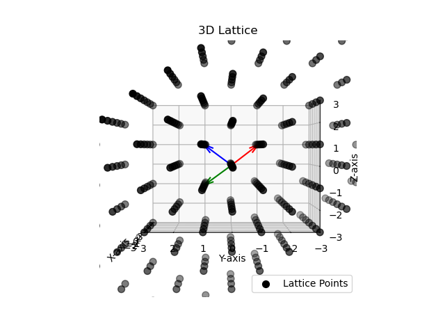
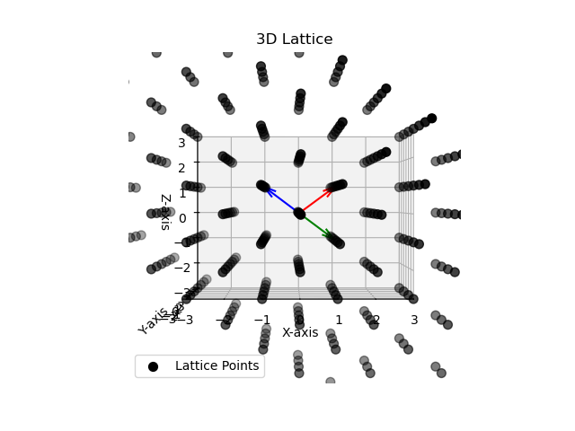
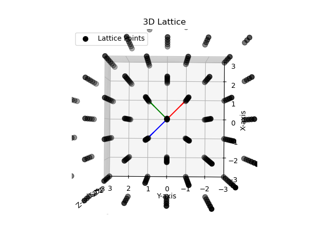

# PKU_machine_learning_term_proj

*Author: Xu Yue, Yi Xiaoyu, An Ruibo, Zhang Lingxin*

This is a course project for the Machine Learning course at Peking University. 

In this work, we present a Python and C++ implementation that replicates the numerical optimization algorithm for designing lattices with minimal normalized second moments (NSM). The algorithm uses stochastic gradient descent (SGD), treating the NSM as a function of the generator matrix, and updates all elements in the direction of the negative gradient for efficient lattice optimization.

We have replicated the algorithm across dimensions from 2 to 16, with a particular focus on 2D and 3D cases, where we provide visualizations of the optimized lattices. Additionally, we apply the theta image representation to all dimensions as a tool for examining the lattice structures. Our results validate the correctness of the original paper’s findings.

## Quickstart

```bash
pip install -r requirements.txt
python test_2d.py
```

## Source codes

### Algorithm implementation

In `utils.py` are the implementations of utility functions including the following:

- `GRAN`
- `URAN`
- `CLP`
- `RED`
- `ORTH`
  
Please refer to paper "Optimization and Identification of Lattice Quantizers" for the detailed definition of each function.

**The implementation of function above has been checked to be correct.**

In `ilc.py` is the implementation of iterative lattice construction algorithm from the original paper. Directly modified from the pseudocode. 

**In `draw_theta_image.py` is a code to draw the theta image of lattice, but it still has some bugs to be FIXED.**

### Unit test and visualization

In `test_2d.py` is the test code for a 2d-case visualization. It can output a hexagonal lattice as expected. 


In `test_3d.py` is the test code for a 3d-case visualization. It can output a body-centered cubic lattice. Note that in this case we performed rotation for a better visualization.

2d and 3d cases are all correct as expected. Visulization results are as follows. You can also generate these results by directly running `test_2d.py` and `test_3d.py`.

- 2d case

  
  Basis vectors are plotted in red and blue respectively. Lattice points are black dots. It is clear that our implementation generates a hexagonal lattice.
  

- 3d case

  
  Basis vectors are plotted in red, blue and green respectively. Lattice points are black dots. It is clear that our implementation generates a body-centered cubic lattice.

  Below are 3d visulization results looking from x,y,z axes respectively.
  
  
  

  Below is a gif demo of our 3d visulization.
  

## C++ Version

C++ version is implemented with LibTorch (the C++ counterpart of Pytorch) and Eigen3. The code is in `./c++`.

### Requirements
Please make sure you already have [CMake](https://cmake.org/) installed. Check the comments in `CMakeLists.txt` for more details.

**1. LibTorch**

Download LibTorch from the [official website](https://pytorch.org/cppdocs/installing.html).
Then, modify `CMAKE_PREFIX_PATH` and `include_directories` in `./c++/CMakeLists.txt` if necessary.

If you have installed PyTorch, you may run the following python code:
  ```python
  torch.utils.cmake_prefix_path
  ```
The code prints out the CMake config path. Then add the following line to CMakeLists:
```
set(CMAKE_PREFIX_PATH YOUR/CMAKE/PATH)
```

**2. Eigen3**

Download Eigen3 from the [official website](https://eigen.tuxfamily.org/) and add the path of the package to `CMakeLists.txt` if needed.